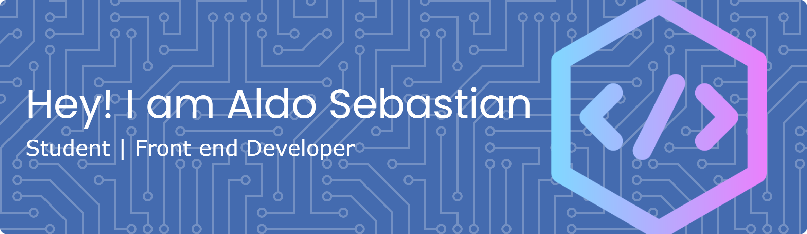

  

  <h1>👋 Hi, I'm Aldo Sebastian</h1>

  
Web Developer | UI/UX Designer | Microsoft Office Expert

  
3rd Semester Computer Science Student | Always learning new technologies 🚀

---

## 🧑‍💻 About Me

- 📍 Medan, Indonesia
- 🎓 3rd Semester Computer Science
- 💼 Focus: Web Development, UI/UX Design, Office Automation
- 🌱 Currently learning: Modern JavaScript, React, Node.js
- 🤝 Open to collaboration & freelance
- 📫 Email: emailaldosebastian@gmail.com

---

## 🛠️ Tech Arsenal

### 💻 Development

### 🎨 Design

### ⚙️ Tools

---

## 📊 GitHub Analytics

 

---

## 🌟 Quick Stats & Activity

---

    <h3>💬 Let's Connect & Collaborate!</h3>
    <em>"Always ready to work on exciting projects and learn new technologies!"</em>
      
    
    
    

     
    <strong>Made with ❤️ by <a href="https://github.com/aldosebastian1">aldosebastian1</a></strong>

